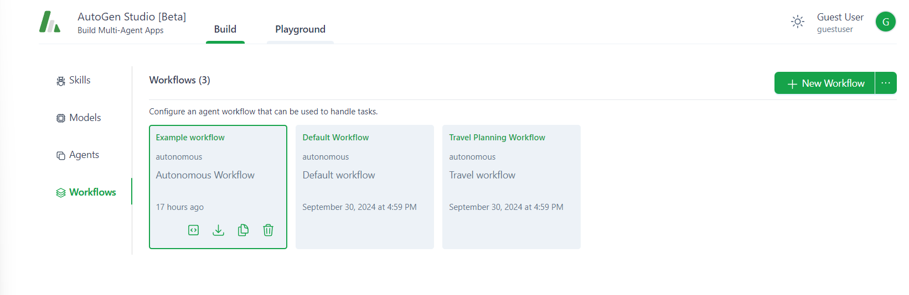
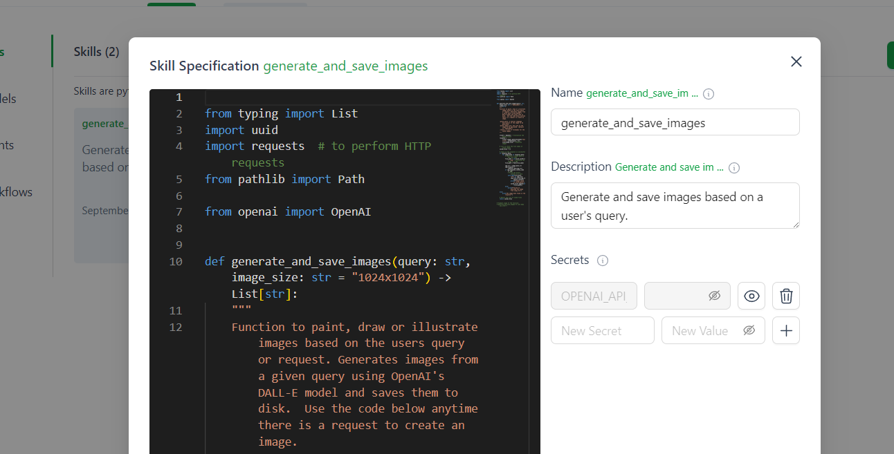

# Multi Agent System with AutoGen Studio

Welcome to the AutoGen workshop. This repository serves as a supporting guide and contains some assets that we will examine together during the workshop.

First, install AutoGen Studio on your PC. AutoGen Studio is a web server that you can operate locally through your browser. The studio allows you to create and manage teams of AI agents.

The repository contains example team configurations in JSON format, which you can load into the studio.

## Quickstart Checklist

- [x] Introduction to Agents
- [ ] Group Division for hands-on
- [ ] Hands-on: Install AutoGen
- [ ] Hands-on: Setup AutoGen
- [ ] Hands-on: Create Tetris
- [ ] Hands-on: Custom Workflow

Follow the [installation instructions](docs/install.md) to get started AutoGen Studio. Once the platform is running you can walk through [this](docs/tetris-config.md) step-by-step guide to building Tetris. Once you have tetris up and running, you can create a [custom workflow](docs/custom-workflow.md).

We provide you with a script that starts AutoGen Studio without loading default configurations:

```bash
(autogen) $ ./scripts/run-ags-wout-defaults.py ui --appdir ./db

## Tour of AutoGen Studio

Here is the AutoGen Studio start screen. On the left tab, you will find the sections `Skills`, `Models`, `Agents`, and `Workflows`, which we will now explore in more detail.



### Skills

Skills display a list of Python functions available to the agents. Agents assigned a skill can execute it depending on the state of the LLM model with
inferred parameters. This can be used, as shown in the example, to generate and save an image.



### Models

Models show a list of the deep learning models available in the studio. Each model can be assigned to an agent and forms the basis of the agent's data processing.

### Agents

Agents display a list of the agents stored in the studio. There are three types of agents:

1. **User Proxy Agent.** This agent either receives a prompt from the user (you) or can execute Python and other code blocks.

2. **Assistant Agent.** An assistant processes a prompt with the underlying LLM model and responds to the prompter. The assistant agent can also execute code blocks and process the output further.

3. **GroupChat Manager.** This manager coordinates interactions between multiple agents. It receives text from one agent and determines to which agent the text should be forwarded.

### Workflows

Workflows display the list of workflows. Each workflow instantiates a set of agents and establishes communication relationships between them.

There are two types of workflows to choose from:

1. **Autonomous (Chat).** A group of agents participates in a message exchange, where ($n>2$) a GroupChat Manager decides to whom a message is directed.

2. **Sequential.** A sequence of agents exchanges messages in a specific order.


## Useful links
- [Autogen Documentation](https://microsoft.github.io/autogen/docs/reference/agentchat/conversable_agent/)
- [System Prompt Generator:](https://chatgpt.com/g/g-8qIKJ1ORT-system-prompt-generator) let ChatGPT create perfectly formatted prompt for your agent based on best-practices
- [The Tokenizer Playground:](https://huggingface.co/spaces/Xenova/the-tokenizer-playground) count number of tokens in your prompts
